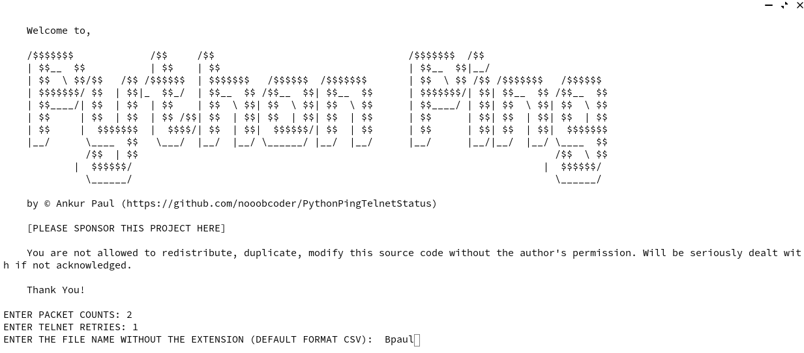
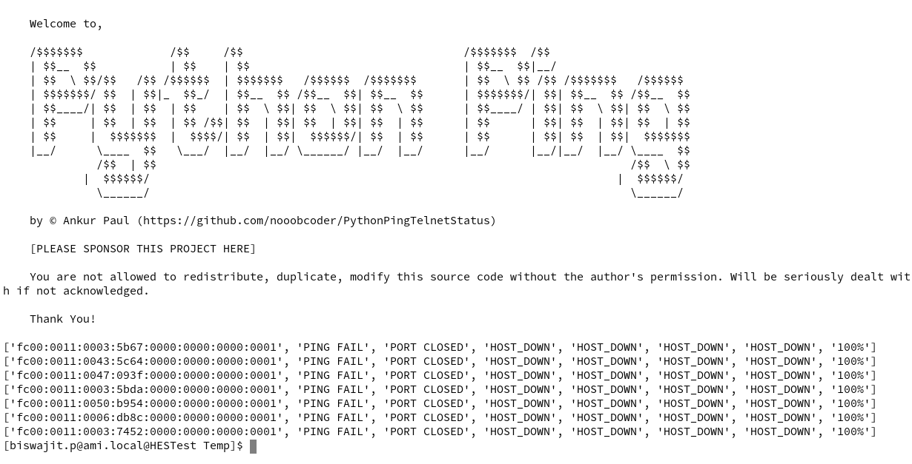
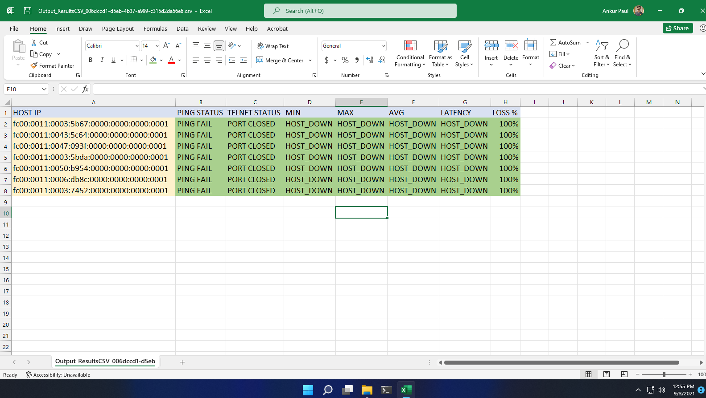

## PythonPing by Ankur Paul

> This python script works only on **Python 2**. While this could be developed for Py3, but the requirements of the client was only in Python2.

> **Script well tested for CSV files** > **This script currently pings for ipv6 addresses only, ipv4 support shall come soon**

### Screenshots

#### Instructions for run

1. Clone the **github repo** by `git clone https://github.com/nooobcoder/PythonPingTelnetStatus.git`
2. Check if **Python2** is installed
   `python --version`
3. Run the script using: `python python2port.py`

_After the script has run, check the newly created **output** folder where the resultant files are output_

---
